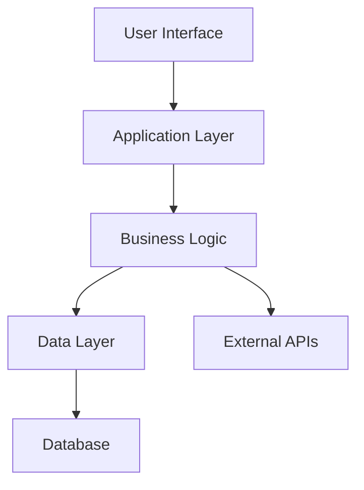

# Architecture Overview

This directory contains design decisions, system diagrams, and architectural documentation.

## Contents

### Design Documents

- System architecture diagrams
- Component interaction flows
- Data flow diagrams
- Deployment architecture

### Diagram Formats

We support multiple diagram formats:

- **Mermaid** - Embedded in Markdown, rendered by GitHub
- **PlantUML** - For complex diagrams
- **ASCII Art** - For simple diagrams in documentation

## Quick Reference

### High-Level Architecture

### Component Overview

| Component | Description | Technology |
|-----------|-------------|------------|
| Frontend | User interface | TBD |
| Backend | Application logic | TBD |
| Database | Data storage | TBD |
| Cache | Performance layer | TBD |

## Architecture Decision Records

Major architectural decisions are documented in [Development/Decision Logs](../development/decision-logs/) using the ADR format.

## Contributing

When adding architecture documentation:

1. Use diagrams where possible
2. Keep diagrams up-to-date with code
3. Link to relevant ADRs
4. Include both high-level and detailed views
